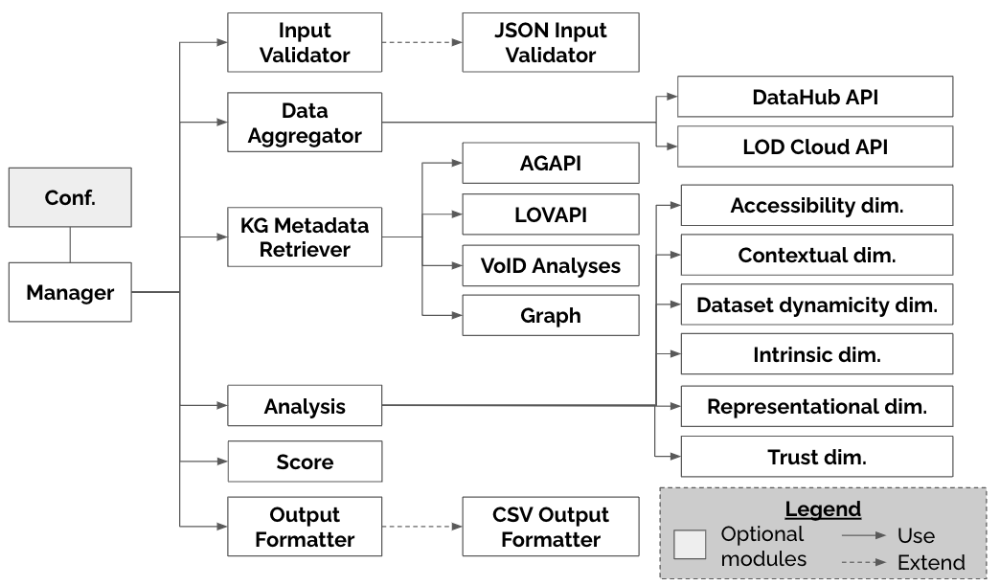
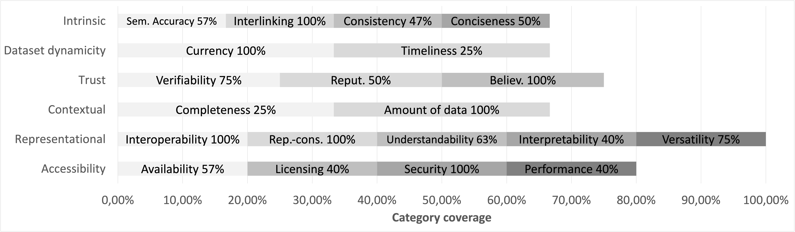
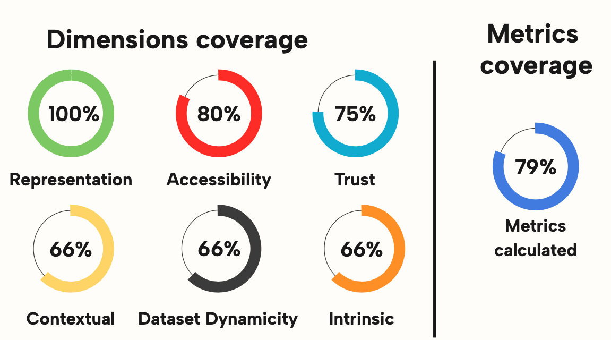
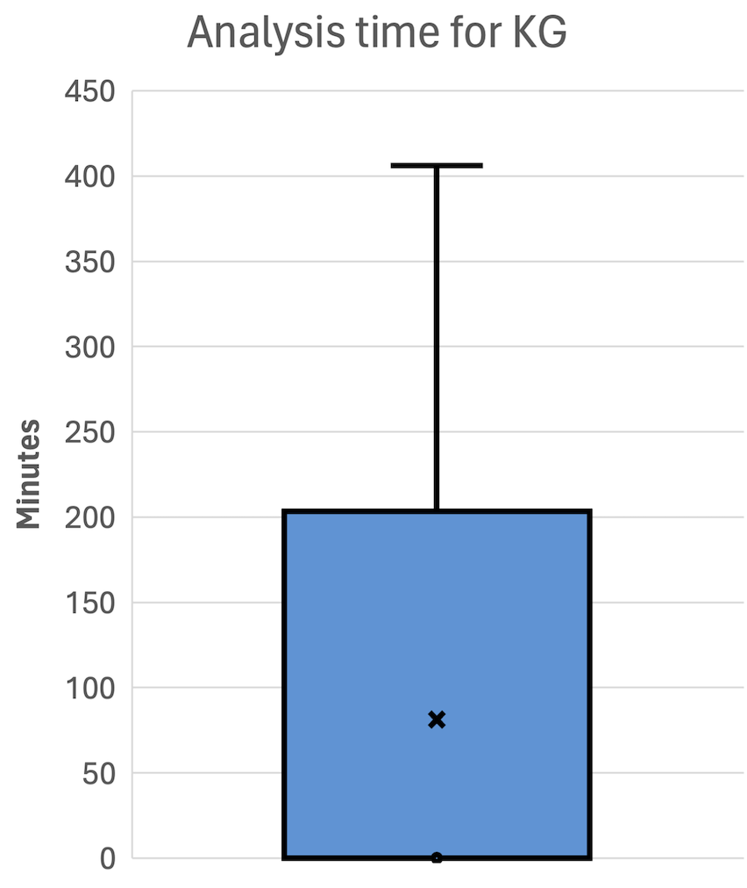

<h1 align="center">QualityAnalyzer</h1>

<p align="center">
  <i>An Open Source Tool for Periodically Evaluating the Quality of Knowledge Graphs</i>
</p>

---

<details>
  <summary>Table of Contents</summary>
  <ol>
    <li><a href="#quality-metrics-covered">Quality metrics covered</a></li>
    <li><a href="#performance">Performance</a></li>
    <li><a href="#license">License</a></li>
    <li>
        <a href="#how-to-use-qualityanalyzer">How To Use QualityAnalyzer?</a>
        <ul>
            <li><a href="#dependencies">Dependencies</a></li>
            <li><a href="#input-configuration">Input configuration</a></li>
            <li><a href="#results">Results</a></li>
        </ul>
    </li>
    <li><a href="#how-include-a-new-quality-metric">How include a new quality metric?</a></li>
  </ol>
</details>

## 🚀 What's New?  
- **SPARQL endpoint as input** – It is now possible to analyze the quality of any desired Knowledge Graph by indicating its SPARQL endpoint in the input configuration of QualityAnalyzer and without it is necessarily registered in LOD Cloud or Datahub. See the section [Input configuration](#input-configuration) for more info.


# Architecture



## Quality metrics covered
Below is a graph showing the quality dimensions covered by QualityAnalyzer and the percentage of metrics measured in each of them.




The following figure shows the percentage of sizes and categories covered by QualityAnalyzer.


## Performance
At the end of the analysis execution, in the root directory of the project there will be a [performance.txt](./performance.txt) file, which will contain various information on the time taken for the analysis of each KG (with the time for the calculation of each metric) and the time of the analysis in total. The performance data that we illustrate below, and the file provided in the repository, refer to the analysis of all the KGs automatically discoverable carried out on 2023/12/24.

|Total KGs analyzed|Total time (hours)| Average time for the analysis of one KGs (minutes)| Standard deviation (minutes) |
|---|---|---|----|
|1882|89.40 ~ 4 days|2.82|21.24|

The KG that required the longest time for analysis was **B3Kat - Library Union Catalogues of Bavaria, Berlin and Brandenburg**, the total time was: ~6.77 hours. The quality metric that took the longest time to analyze was *Intrinsic Category -> Consistency -> Undefined classes*, with ~5 hours to complete the calculation, this is mainly due to the large amount of triples that are present in this KG (1.022.898.443 of triples).
The box plot illustred below shows the times for calculating the quality for each KGs. 

## License
QualityAnalyzer is licensed under the [MIT License](https://opensource.org/license/mit/).

# How to Use QualityAnalyzer
This section provides an overview about the use of QualityAnalyzer and how it can be extended.
To follow the next steps, clone this repository. The tool is tested and working on Python <= 3.11

## Dependencies
For the execution of the project it is recommended to create a Python Virtual Environment, so from the project root directory run the following commands:
```
pip install virtualenv
python<version> -m venv <virtual-environment-name>
source env/bin/activate 
// or for Windows users
env/Scripts/activate.bat //In CMD
env/Scripts/Activate.ps1 //In Powershel
```
First of all, install all dependencies from the project root:
```
pip install -r requirements.txt
```
## Input configuration
From the [configuration.json](./src/configuration.json) file, you can choose the Knowledge Graph to analyze. You can analyze it by using a list of keywords, ids (indicated in LOD cloud or DataHUB) or by explicitly indicating the SPARQL endpoint (also a combination of these methods is possible). In the example below, all the Knowledge Graphs that have the keywords *"museum"* will be analyzed.
```
{"name": ["museum"], "id": [], "sparql_url" : []}
```
Or, by a list of ids like this:
```
{"name": [], "id": ["dbpedia","taxref-ld"], "sparql_url" : []}
```
Or, by indicating the SPARQL endpoint:
```
{"name": [], "id": [], "sparql_url" : ["https://dbpedia.org/sparql"]}
```
If instead, you want to analyze all the Knowledge Graphs automatically discoverable from [LODCloud](https://lod-cloud.net/) and [DataHub](https://old.datahub.io/), insert the "all" value in the list (you can indicate it in the ```name``` or ```id``` key):
<a name="all-kgs-conf"></a>
```
{"name": ["all"], "id": [], "sparql_url" : []}
```
After the input configuration, to execute the analysis simply launch form the main directory of the project:
```
python3 manager.py
```
## Results
The results of the analysis will be inserted in a .csv file in the *"Analysis results"* directory, along with a .log file containing any errors that occurred during the measurement. Each line of the csv file representa a KG, and on the columns we find the different quality metrics analyzed.

## How include a new quality metric?
If you want to include a new quality metric, you need to include the calculation inside the [analyses.py](analyses.py) module. If this new metric requires the use of a new query on the SPARQL endpoint, you can add a new query in the [query.py](query.py) module and call it from the [analyses.py](analyses.py) module .Then, based on the quality dimension to which it belongs, modify the related class in the [QualityDimensions](/QualityDimensions/) folder, or create a new class if this belongs to a new dimension. If you created a new dimension for the new metric, it must be included in the [KnowledgeGraph.py](KnowledgeGraph.py) class. Then instantiate the classes in the [analyses.py](analyses.py) to assign the value obtained from the new quality metric. If you want also to see this new metric in the csv file given in output, you need to edit the [OutputCSV.py](OutputCSV.py) module appropriately. Essentially you have to include a new header, having as name the name of the new metric and then recall the value of the metric from the [KnowledgeGraph.py](KnowledgeGraph.py) object appropriately constructed in the [analyses.py](analyses.py) module.


